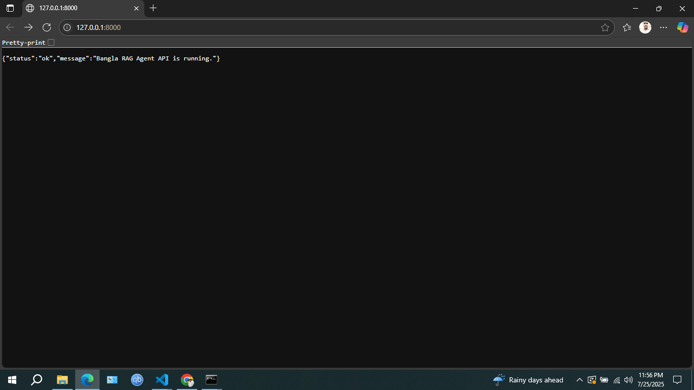
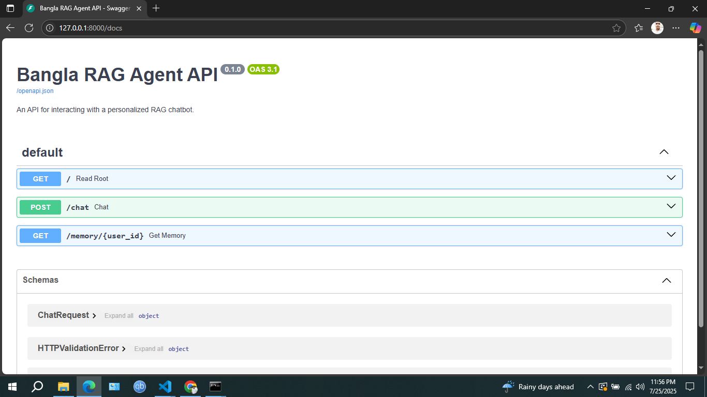
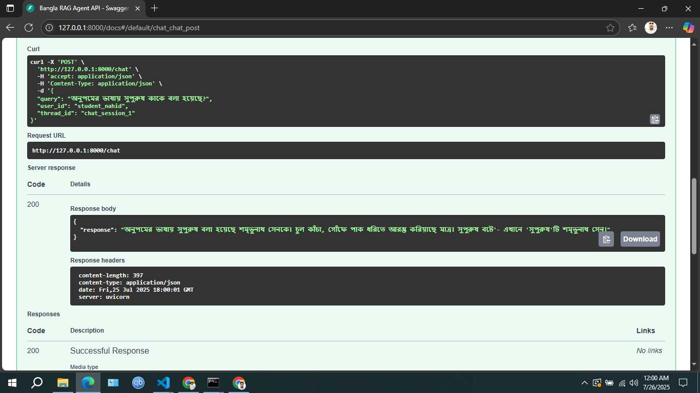
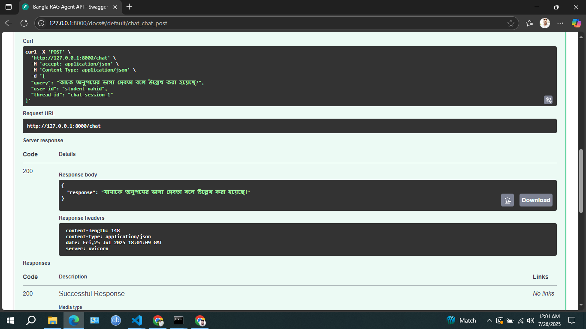
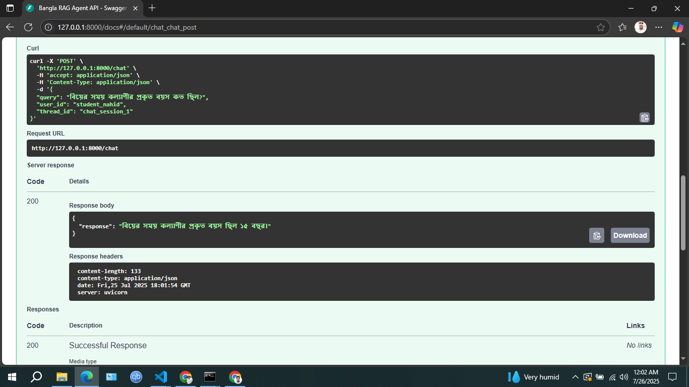

# **Personalized Bengali Tutor – A RAG Agent with Long-Term Memory**  
  
  
  
  

## **📖 Overview**  
This project demonstrates the evolution of a **Retrieval-Augmented Generation (RAG)** chatbot into a **personalized intelligent tutor** named **“সহায়ক বাংলা শিক্ষক”** (Helpful Bengali Tutor). The system answers questions based on **Bengali literature and English texts**, remembers user details across sessions, and provides a highly interactive learning experience.

Key innovation: It combines **RAG**, **long-term memory**, and **agentic decision-making** with a modern UI and scalable backend.

---

## **✨ Core Features**
- ✅ **Retrieval-Augmented Generation (RAG):** Uses a Pinecone vector database to retrieve context from Bengali and English texts, ensuring accurate and grounded answers.  
- ✅ **Agentic Workflow with LangGraph:** A **state machine** that evaluates retrieved information and dynamically decides the next step.  
- ✅ **Web Search Fallback:** If the knowledge base lacks the answer, it performs **autonomous web search** using **Serper API**.  
- ✅ **Persistent Long-Term Memory:** Stores **user-specific details** (name, class, interests) across sessions for a personalized experience.  
- ✅ **Interactive Web UI (Streamlit):** Includes a **real-time memory visualization sidebar** and an intuitive chat interface.  
- ✅ **Scalable API Backend (FastAPI):** Decoupled architecture for **independent scaling of frontend and backend**.  

---

## **📐 System Architecture**
```
+--------------+      +------------------+      +---------------------+
|  Streamlit   | <--> |   FastAPI API    | <--> |   LangGraph Agent    |
|   (UI)       |      |  (main.py)       |      |  (agent_graph.py)    |
+--------------+      +------------------+      +----------+----------+
                                                          |
                                           +--------------+--------------+
                                           |                             |
                                   [Is context relevant?]               |
                                           |                             |
                                     (Routing Node)                      |
                                           |                             |
                     +----------------------+----------------------+     
                     |                                             |
                  (Yes)                                         (No)
                     |                                             |
+-------------------+      +-------------------+      +-------------------+
| Pinecone          | <--> | Retrieve Node     |      | Web Search Node   |
| (Vector DB)       |      | (RAG Context)     |      | (Fallback)        |
+-------------------+      +-------------------+      +-------------------+
```

---

## **🛠️ Tech Stack**
- **Backend:** FastAPI  
- **Frontend:** Streamlit  
- **LLM Orchestration:** LangChain, LangGraph  
- **LLM Provider:** Groq (LLaMA 3)  
- **Vector DB:** Pinecone  
- **Embeddings:** Hugging Face `sentence-transformers/all-mpnet-base-v2`  
- **Web Search:** Serper API  

---

## **🚀 Setup & Installation**
### **1. Prerequisites**
- Python 3.9+  
- API Keys for:  
  - Groq  
  - Pinecone  
  - Hugging Face  
  - Serper  

---

### **2. Clone the Repository**
```bash
git clone https://github.com/myself-nahid/bengali-tutor-chatbot.git
cd bengali-tutor-chatbot
```

---

### **3. Create Virtual Environment**
```bash
python -m venv venv
# Activate:
# macOS/Linux
source venv/bin/activate
# Windows
.venv\Scripts\activate
```

---

### **4. Install Dependencies**
```bash
pip install -U fastapi uvicorn[standard] streamlit requests langchain langgraph langchain-groq langchain-huggingface langchain-pinecone pinecone-client pydantic>=2.0 python-dotenv sentence-transformers langchain-community google-search-results wikipedia langchain-tavily
```

---

### **5. Configure Environment Variables**
Create a `.env` file in the project root:
```
# API Keys
GROQ_API_KEY="gsk_..."
HF_TOKEN="hf_..."
PINECONE_API_KEY="..."
SERPAPI_API_KEY="..."

# Optional (LangSmith tracing)
LANGCHAIN_TRACING_V2="true"
LANGCHAIN_PROJECT="Personalized Bengali Tutor"

# Model & Index Config
LLAMA_MODEL="llama3-8b-8192"
PINECONE_INDEX_NAME="10ms-db-bangla-book"
EMBEDDING_MODEL_NAME="sentence-transformers/all-mpnet-base-v2"
```

---

## **▶ Running the Application**
### **Phase 1: Data Ingestion (One-Time)**
1. Prepare `english-docs.txt` and `book-data.txt` inside `Bangla-Book` folder.  
2. Run:
```bash
jupyter notebook
# Open and run `simple-rag.ipynb` to create embeddings & upload to Pinecone
```

---

### **Phase 2: Start the Web App**
Run **two terminals**:

**Terminal 1: Start FastAPI Backend**
```bash
cd src
uvicorn main:app --host 127.0.0.1 --port 8000 --reload
```

**Terminal 2: Start Streamlit Frontend**
```bash
cd src
streamlit run streamlit_app.py
```

Access UI: **http://localhost:8501**

---

## **📸 Screenshots**
Here are some sample interactions demonstrating the system's capabilities, including its long-term memory.








## **📂 Project Structure**
```
bengali-tutor-chatbot/                 
├── notebooks/              # Jupyter notebooks for experiments                 
    ├── 01-RAG/                  
            ├── books/            
                ├── english-docs.txt
                ├── book-data.txt
            ├── simple-rag.ipynb
        02-RAG-Memory-LabgGraph/                  
            ├── rag-memory.ipynb
        03-Agentic-RAG-Long-Term-Memory/                  
            ├── agentic-rag-ltm.ipynb    
├── src/                    # Application source code                 
    ├── app/                  
        ├── agent_graph.py
        ├── config.py
        └── main.py
        └── schemas.py
    ├── streamlit_app.py
├── .env                    # Environment variables (API keys)
├── requirements.txt        # Python dependencies
├── README.md               # Project documentation
```

---

## **✅ Features Roadmap**
- [x] Core RAG pipeline  
- [x] Long-term memory  
- [x] Web search fallback  
- [ ] Multi-user memory storage (Redis / DB)  
- [ ] Speech-enabled interface  
- [ ] Mobile-friendly UI  

---

---
## **Answering Key Design Questions**

## 1. Text Extraction Method and Challenges

**Method/Library Used:**
The `langchain_community.document_loaders.PyPDFLoader` library was utilized for extracting text content from the PDF file, specifically "books/HSC26-Bangla1st-Paper.pdf". This is a standard and convenient tool within the LangChain ecosystem for ingesting PDF data.

**Formatting Challenges:**
Yes, formatting challenges were encountered during the PDF text extraction. The raw extracted text showed issues such as the presence of `\x00` characters and inconsistent newline formatting (`\n`). These typically indicate problems with character encoding, rendering of non-standard fonts, or artifacts from optical character recognition (OCR) if the PDF was image-based. Such anomalies can negatively impact the quality of subsequent text processing steps like chunking and embedding.

## 2. Chunking Strategy

**Chosen Strategy:**
The chosen chunking strategy employs `langchain_text_splitters.RecursiveCharacterTextSplitter`. The text was split into chunks of `1000` characters with an `overlap` of `100` characters.

**Why it Works for Semantic Retrieval:**
This strategy is well-suited for semantic retrieval due to the following reasons:
*   **Hierarchical Splitting:** `RecursiveCharacterTextSplitter` attempts to split documents based on a hierarchy of delimiters (e.g., `\n\n`, `\n`, spaces). This approach helps maintain the semantic integrity of the text by keeping related sentences and paragraphs together within a single chunk, which is crucial for capturing the complete meaning of a passage.
*   **Contextual Overlap:** The `100`-character overlap between consecutive chunks is vital. It ensures that if a critical piece of information or a phrase that's semantically significant falls across a chunk boundary, both chunks will contain enough context to be retrieved effectively. This minimizes the "lost in the middle" problem, where an embedding model might miss relevant information due to an arbitrary split.

## 3. Embedding Model Selection

**Chosen Embedding Model:**
The embedding model used is `sentence-transformers/all-mpnet-base-v2`, loaded via `langchain_huggingface.HuggingFaceEmbeddings`.

**Reasons for Selection:**
*   **High Performance:** `all-mpnet-base-v2` is widely recognized as a robust and high-performing general-purpose sentence embedding model. It excels at generating semantically rich vector representations.
*   **Accessibility and Ease of Use:** Being part of the Sentence-Transformers family and readily available through Hugging Face, it offers easy integration and a large community support base.
*   **Semantic Capture:** This model captures the meaning of text by mapping sentences and passages into a high-dimensional vector space. Texts with similar meanings will have their corresponding vectors located closer to each other in this space. This enables the RAG system to find semantically relevant document chunks, even if they don't share exact keywords with the query.

## 4. Query-Chunk Comparison and Storage

**Similarity Method:**
The comparison between the user query and the stored document chunks is performed using **cosine similarity**. This was configured when the Pinecone index was created, specifying `metric="cosine"`.

**Storage Setup:**
The chosen storage solution is **Pinecone**, a cloud-native vector database. `langchain_pinecone.PineconeVectorStore` facilitates the interaction between LangChain's document handling and Pinecone's efficient vector indexing capabilities.

**Why this Setup:**
*   **Cosine Similarity:** Cosine similarity is effective for high-dimensional data like embeddings. It measures the angle between two vectors, indicating the orientation similarity. This makes it robust to differences in text length and focuses purely on the semantic direction, which aligns well with the goal of retrieving semantically similar content.
*   **Pinecone for Scalability:** Pinecone offers a managed service for vector storage and retrieval at scale. It allows for rapid nearest-neighbor searches across millions or billions of vectors, which is essential for a performant RAG system handling a large corpus of documents and numerous user queries.

## 5. Ensuring Meaningful Comparison and Handling Vague Queries

**Meaningful Comparison:**
The meaningful comparison is primarily ensured by the **embedding process**. Both the user's query and the document chunks are transformed into dense, semantically-aware numerical vectors by the chosen embedding model (`sentence-transformers/all-mpnet-base-v2`). The subsequent cosine similarity search in Pinecone then effectively identifies chunks whose semantic meaning (represented by their vector orientation) is closest to that of the query.

**Handling Vague or Missing Context Queries:**
*   **Basic RAG (`simple-rag.ipynb`):** In the simpler implementation, if the query is vague, lacks context, or the answer is not present in the internal PDF document, the system is explicitly instructed to politely state that it lacks sufficient information. For example, a query like "কল্যাণী কোন ব্রত গ্রহণ করে?" correctly elicited a "দুঃখিত, উত্তর দেওয়ার মতো পর্যাপ্ত তথ্য আমার কাছে নেই।" response, as the specific information wasn't found in the provided document. The `rag_prompt` explicitly prevents hallucination in such cases.

*   **Agentic RAG with Long-Term Memory (`agentic-rag-ltm.ipynb`):** This more advanced implementation employs an **agentic workflow** to handle vague or out-of-context queries more intelligently. It includes a `grade_document_node` which assesses the relevance of the retrieved internal documents. If the internal documents are deemed "not relevant" to answer the question, the system **dynamically routes the query to a web search tool** (`search_on_web_node`). This allows the agent to seek information externally, preventing an "I don't know" response for questions that can be answered by public knowledge, thus providing a more comprehensive and helpful experience.

## 6. Relevance Assessment and Potential Improvements

**Relevance Assessment:**
*   **Successful Cases:** For queries like "বিয়ের সময় কল্যাণীর প্রকৃত বয়স কত ছিল?" and "কাকে অনুপমের ভাগ্য দেবতা বলে উল্লেখ করা হয়েছে?", the agentic RAG successfully provided correct answers. This indicates effective retrieval (either from internal documents or web search) and accurate generation.
*   **Challenges in Basic RAG:** The basic RAG struggled with external knowledge questions like "What two national anthems were sung on the day of the inauguration?", leading to hallucinations. It also correctly identified when it lacked information for "কল্যাণী কোন ব্রত গ্রহণ করে?" if the specific answer wasn't present in the limited internal corpus.
*   **Agentic Improvement:** The agentic RAG's ability to pivot to web search (as seen with "অনুপমের ভাষায় সুপুরুষ কাকে বলা হয়েছে?") significantly enhances its overall relevance by addressing queries beyond its initial document set.

**Potential Improvements:**

1.  **Enhanced Document Preprocessing:**
    *   **Text Cleaning:** Implement more robust text cleaning to remove or normalize problematic characters (like `\x00`) and ensure consistent newline handling.
    *   **OCR Quality:** If the PDF originates from scanned images, investing in higher-quality OCR might yield cleaner text.

2.  **Advanced Chunking Strategies:**
    *   **Semantic Chunking:** Explore techniques that group text based on semantic coherence rather than strict character limits. This can involve using LLMs or graph-based methods to identify thematic boundaries.
    *   **Parent Document Retrieval:** For very specific queries, retrieve smaller, highly relevant chunks. Then, for the LLM's context, retrieve larger "parent" documents or even full pages/sections to provide richer context for answer generation.

3.  **Domain-Specific or Multilingual Embeddings:**
    *   **Bengali-Specific Models:** Using an embedding model specifically trained or fine-tuned on a large corpus of Bengali text, especially literary works, could significantly improve the semantic understanding and retrieval accuracy for Bengali questions.
    *   **Cross-Lingual Models:** While `all-mpnet-base-v2` can show some cross-lingual capabilities, dedicated multilingual embedding models might offer better performance if the system needs to consistently handle questions in multiple languages beyond just English and Bengali.

4.  **Expanded Document Corpus:**
    *   **Broader Bengali Literature:** Incorporating a wider range of Bengali literary texts, including critical analyses, summaries, and related historical information, would increase the internal knowledge base and reduce the reliance on web searches for core subject matter.
    *   **Curated Content:** Curating high-quality, relevant content specifically for the target audience (e.g., HSC Bengali literature syllabus) would ensure the RAG system is highly effective for its intended purpose.

5.  **Refined LLM Prompting:**
    *   **Iterative Prompt Engineering:** Continuously experiment with the prompt template (`rag_with_memory_prompt`) to guide the LLM more effectively in synthesizing information from context and memory, and to maintain the desired tone and response style.
    *   **Answer Constraints:** Add more specific instructions regarding answer length, detail level, and how to integrate personalized memory aspects without over-personalizing.

6.  **Confidence-Based Routing/Response:**
    *   Beyond a binary "yes/no" grade, incorporating a confidence score from the `grade_document_node` could allow for more nuanced routing decisions (e.g., if confidence is moderate, try web search *and* internal docs).
    *   The LLM could also be prompted to express its confidence in its answer, guiding the user if the information is uncertain or incomplete.
---